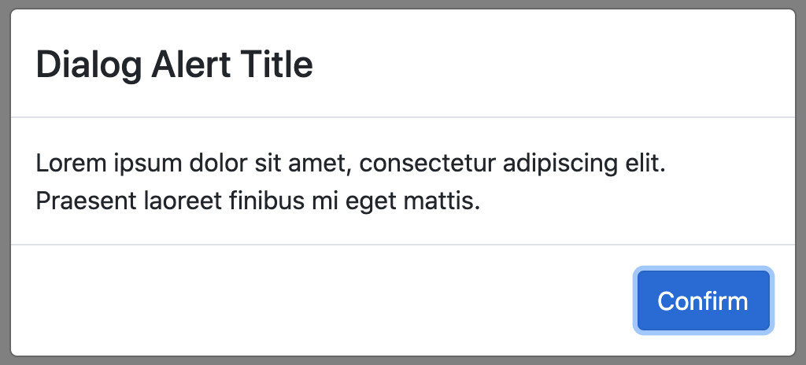
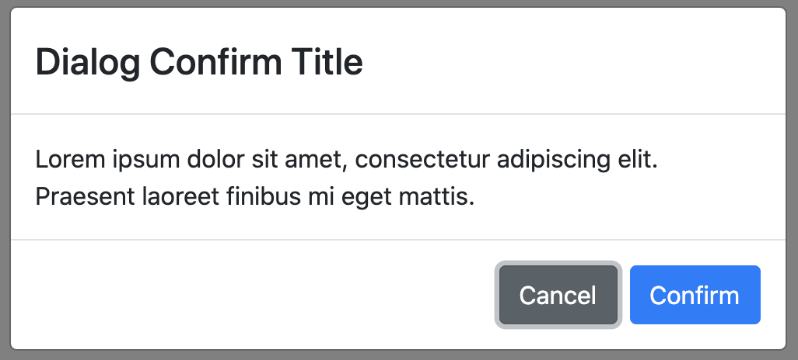

# Ngx Bootstrap Dialog

Simple and customizable dialogs for Angular built on top of [NG Bootstrap](https://ng-bootstrap.github.io/#/home).

[](https://circleci.com/gh/manzapanza/ngx-bootstrap-dialog)
[](https://coveralls.io/github/manzapanza/ngx-bootstrap-dialog?branch=master)

## Dependencies

| ngx-bootstrap-dialog | ng-bootstrap | Angular |
| -------------------- | ------------ | ------- |
| 1.x.x                | 6.x.x        | 9.x.x   |

## Demo

Please check the [demo](https://manzapanza.github.io/ngx-bootstrap-dialog)!




## Getting started

### Install:

```
npm install ngx-bootstrap-dialog --save
```

### Import module:

```
//...
import { NgxBootstrapDialogModule } from 'ngx-bootstrap-dialog';
//....

@NgModule({
  declarations: [AppComponent],
  imports: [
    //...
    NgxBootstrapDialogModule
    //...
  ],
  bootstrap: [AppComponent],
})
export class AppModule {}
```

### Inject/Use NgxBootstrapDialogService:

```
//...
import { NgxBootstrapDialogService } from 'ngx-bootstrap-dialog';
//....

@Component({
  selector: 'app-root',
  templateUrl: './app.component.html',
  styleUrls: ['./app.component.scss'],
})
export class AppComponent {
  constructor(private dialog: NgxBootstrapDialogService) {}

  openDialogAlert() {
    this.dialog.alert({
      title: 'Title',
      message: 'Lorem ipsum!',
    });
  }

  openDialogConfirm() {
    this.dialog.confirm({
      title: 'Title',
      message: 'Lorem ipsum?',
    });
  }
}
```

### Method Alert:

The method opens a new alert dialog with the supplied options and return a promise. These options will be merged with the default options (see the values in table below);

```
  alert(options: NgxBootstrapDialogAlertOptions): Promise<any>
```

The promise is resolved by clicking the confirm button and rejected when the dialog is dismissed.

```
    this.dialog.alert({
      title: 'Title',
      message: 'Lorem ipsum!',
    })
    .then(() => console.log('Confimed!'))
    .catch(() => console.log('Dismissed!'));
```

### Alert options and default values (NgxBootstrapDialogOptions):

| Option             | Type            | Default value       | Description                                                                                                                               |
| ------------------ | --------------- | ------------------- | ----------------------------------------------------------------------------------------------------------------------------------------- |
| title              | string          | ''                  | Alert title                                                                                                                               |
| message            | string          | ''                  | Message title                                                                                                                             |
| confirmButtonLabel | string          | 'Confirm'           | Button confirm label                                                                                                                      |
| confirmButtonClass | string          | 'btn btn-primary'   | Button confirm css class                                                                                                                  |
| showConfirmButton  | boolean         | true                | Show confirm button                                                                                                                       |
| cancelButtonLabel  | string          | 'Cancel'            | Button cancel label                                                                                                                       |
| cancelButtonClass  | string          | 'btn btn-secondary' | Button cancel css class                                                                                                                   |
| showCancelButton   | boolean         | false               | Show cancel button                                                                                                                        |
| showCloseButton    | boolean         | false               | Show close button                                                                                                                         |
| ngbModalOptions    | NgbModalOptions | null                | Options available for NgbModal.open() method [see NgbModalOptions](https://ng-bootstrap.github.io/#/components/modal/api#NgbModalOptions) |

### Method Confirm:

The method opens a new confirm dialog with the supplied options and return a promise. These options will be merged with the default options (see the values in table below);

```
  confirm(options: NgxBootstrapDialogAlertOptions): Promise<any>
```

The promise is resolved by clicking the confirm button and rejected by clicking the cancel button or when the dialog is dismissed.

```
    this.dialog.confirm({
      title: 'Title',
      message: 'Lorem ipsum!',
    })
    .then(() => console.log('Confimed!'))
    .catch(() => console.log('Canceled or dismissed!'));
```

### Confirm options and default values (NgxBootstrapDialogOptions):

| Option             | Type            | Default value       | Description                                                                                                                               |
| ------------------ | --------------- | ------------------- | ----------------------------------------------------------------------------------------------------------------------------------------- |
| title              | string          | ''                  | Alert title                                                                                                                               |
| message            | string          | ''                  | Message title                                                                                                                             |
| confirmButtonLabel | string          | 'Confirm'           | Button confirm label                                                                                                                      |
| confirmButtonClass | string          | 'btn btn-primary'   | Button confirm css class                                                                                                                  |
| showConfirmButton  | boolean         | true                | Show confirm button                                                                                                                       |
| cancelButtonLabel  | string          | 'Cancel'            | Button cancel label                                                                                                                       |
| cancelButtonClass  | string          | 'btn btn-secondary' | Button cancel css class                                                                                                                   |
| showCancelButton   | boolean         | true                | Show cancel button                                                                                                                        |
| showCloseButton    | boolean         | false               | Show close button                                                                                                                         |
| ngbModalOptions    | NgbModalOptions | null                | Options available for NgbModal.open() method [see NgbModalOptions](https://ng-bootstrap.github.io/#/components/modal/api#NgbModalOptions) |

### Global config

The global config can be adjusted by providing a value for `NGX_BOOTSTRAP_ALERT_DEFAULT_OPTIONS` and `NGX_BOOTSTRAP_CONFIRM_DEFAULT_OPTIONS` in your application's root module. These options will be merged with the respective default options.

```
//...
import { NgxBootstrapDialogModule } from 'ngx-bootstrap-dialog';
import { NGX_BOOTSTRAP_ALERT_DEFAULT_OPTIONS } from 'ngx-bootstrap-dialog';

//....

@NgModule({
  declarations: [AppComponent],
  imports: [
    //...
    NgxBootstrapDialogModule
    //...
  ],
  providers: [
    {
      provide: NGX_BOOTSTRAP_ALERT_DEFAULT_OPTIONS,
      useValue: { confirmButtonClass: 'btn btn-danger' },
    },
    {
      provide: NGX_BOOTSTRAP_CONFIRM_DEFAULT_OPTIONS,
      useValue: { confirmButtonText: 'CONFIRM' },
    },
  ],
  bootstrap: [AppComponent],
})
export class AppModule {}
```
